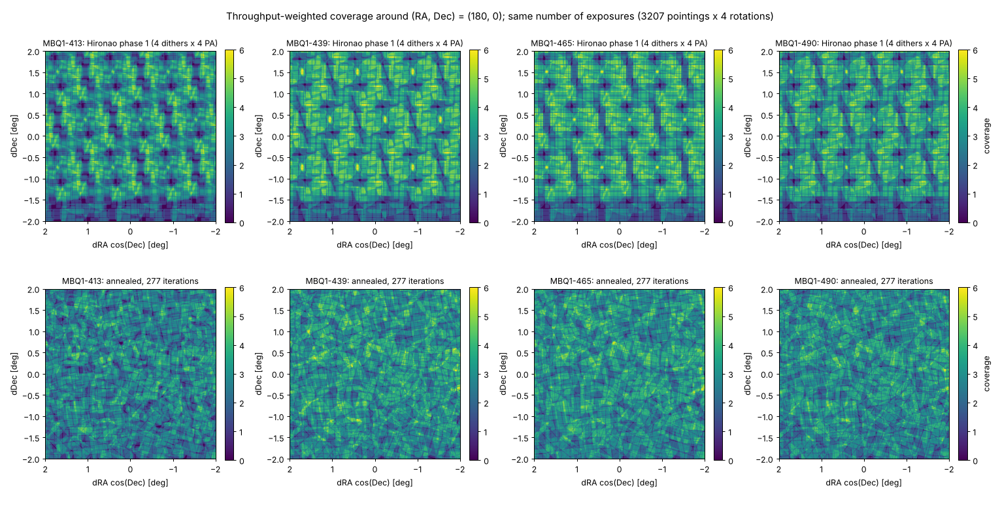
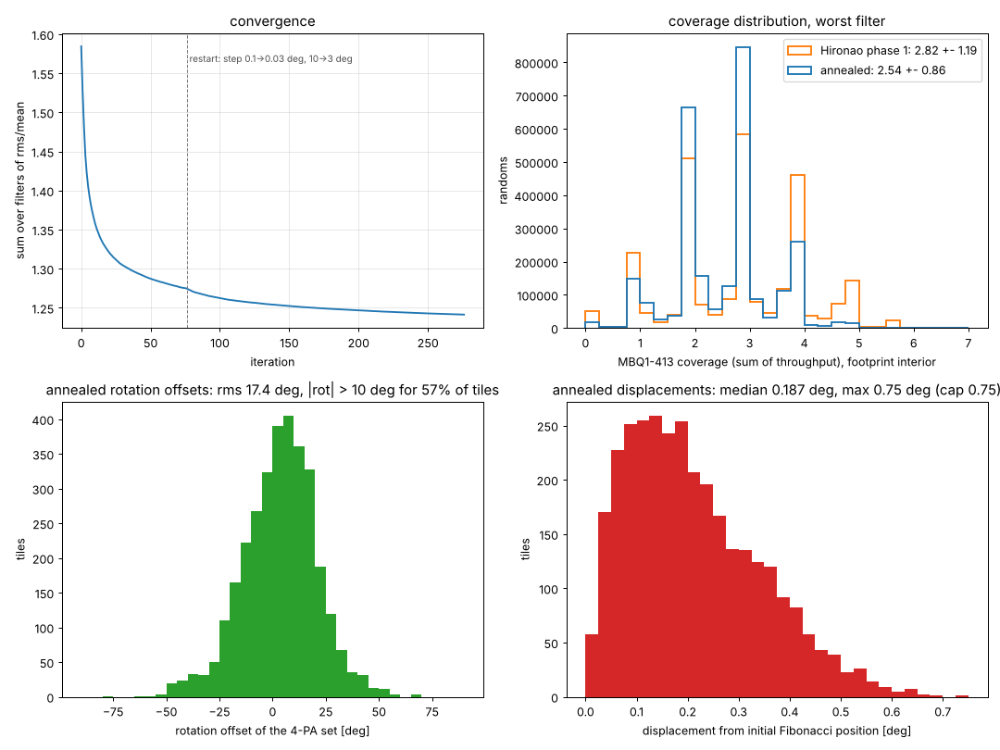

# Annealed tiling for HSC + MBQ1 on the HSC-Niji wide footprint

*D. Schlegel, 2026-10-08. Code: `skytiling` (`optimize_tiling_maps`), data in `data/subaru/`.*

**Setup.** The camera is described by per-sub-filter maps of relative throughput on the focal plane,
built from Hironao Miyatake's MBQ1 dome flats (gain-corrected, sky-area-per-pixel and dome-illumination
gradient divided out, ≈1 over the bulk of the field, 0 where the `NO_DATA` mask flags the
~10.4′-wide filter-holder cross, the vignetted edge beyond 46.5′, dead amplifiers and the two CCDs
absent from the 413 flats). Every pointing is observed at four instrument rotations 90° apart, and
the coverage of a sky point in sub-filter *f* is the sum of throughput over all exposures. Simulated
annealing moves each pointing centre (≤ 0.75°) and the rotation offset of its 4-PA set to minimise the
summed per-filter coverage variance over 4M random points inside the 1194 deg² footprint (0.75° discs
around the 802 HSC-SSP Wide centres at −6° < Dec < 6.4°). Two starting points with the same exposure
budget as Atsushi's phase-1 pattern (4 dithers × 802 field centres × 4 PAs = 12,832 exposures): that
pattern itself (3208 pointings, 300 iterations), and a Fibonacci lattice of 3207 pointings (277
iterations). Each run took ~6 s per iteration on one Perlmutter node with 64 workers (step size 0.1°,
10° shrinking by 0.99 per iteration).

**Result** (footprint interior, 68% of the area, away from the stripe edges; coverage = effective
number of full-throughput exposures):

| | 413 | 439 | 465 | 490 |
|---|---|---|---|---|
| Atsushi phase 1: mean ± rms (rms/mean) | 2.85 ± 1.19 (0.42) | 3.24 ± 1.12 (0.34) | 3.24 ± 1.16 (0.36) | 3.11 ± 1.10 (0.35) |
| &nbsp;&nbsp;&nbsp; fraction < 1.5 / < 0.5 | 13.0% / 2.1% | 6.5% / 0.8% | 7.4% / 1.2% | 7.7% / 0.9% |
| Fibonacci lattice, un-annealed | 2.79 ± 1.08 (0.39) | 3.19 ± 1.08 (0.34) | 3.17 ± 1.15 (0.36) | 3.06 ± 1.04 (0.34) |
| **Annealed from Atsushi phase 1** | **2.60 ± 0.87 (0.34)** | **2.98 ± 0.87 (0.29)** | **2.95 ± 0.85 (0.29)** | **2.86 ± 0.84 (0.29)** |
| &nbsp;&nbsp;&nbsp; fraction < 1.5 / < 0.5 | 9.7% / 0.7% | 4.4% / 0.2% | 4.3% / 0.2% | 5.3% / 0.3% |
| **Annealed from Fibonacci lattice** | **2.56 ± 0.86 (0.34)** | **2.94 ± 0.88 (0.30)** | **2.91 ± 0.85 (0.29)** | **2.81 ± 0.84 (0.30)** |
| &nbsp;&nbsp;&nbsp; fraction < 1.5 / < 0.5 | 10.2% / 0.8% | 4.9% / 0.3% | 4.7% / 0.2% | 5.8% / 0.3% |

For the same number of exposures the annealing lowers the rms of the coverage by 24–28% in every
filter (rms/mean by 14–20%), cuts the deep holes (coverage < 0.5) by a factor 3–6, and removes the
periodic pattern of Atsushi's layout (Figure 1). The mean is 8–10% lower because pointings near the
stripe boundary move outward to flatten the edge and the coverage they put outside the footprint is
not counted; in the interior the annealed solutions are more uniform at every quantile. The two
starting points converge to the same solution quality — the convergence curves lie on top of each
other (Figure 2) and the final statistics agree to within ~1% — with the Atsushi start marginally
ahead (1.5% higher mean, slightly fewer holes), so the result is set by the camera masks and the
tile density, not by the starting layout. 413 remains the worst filter in every case because of its
two missing CCDs. The 0/1 (`GOOD`) and throughput-weighted statistics differ by only 2–4%.

**Rotations.** Allowing the 4-PA set of each pointing to turn is worth a few per cent in rms on top
of the position moves. The annealed offsets (Figure 2, lower left) have an rms of 17–19° in both runs,
with 57–59% of pointings turned by more than 10° and 9–10% by more than 30°; the distribution is broad
and single-peaked with a small positive mean (+3°), i.e. the solution does not favour a particular grid
of angles. The pointings moved by a median 0.19–0.20° from their starting positions (max 0.75° = the
cap, reached by a handful), so in both cases the final layout is a modest perturbation of the start.

**Convergence.** The objective (sum over filters of rms/mean) fell from 1.58 to 1.24 (Fibonacci start)
and from 1.64 to 1.24 (Atsushi start); 85% of the gain came in the first 40 iterations, and the last
100 iterations gained < 0.01 (Figure 2, upper left). At the final slope of 7e-5 per iteration, another
300 iterations would buy well under 1%, so both runs are converged for practical purposes at this tile
density. Larger gains would come from more tiles (lower rms/mean at
higher mean coverage) or from a different objective (e.g. penalising holes rather than variance).

*Figure 1. Throughput-weighted coverage per sub-filter in a 4° × 4° field around (RA, Dec) = (180°, 0°)
for Atsushi's phase-1 pattern (top), the tiling annealed from it (middle, iteration 300) and the tiling
annealed from the Fibonacci lattice (bottom, iteration 276), same colour scale.*

*Figure 2. Convergence of the objective for both starts; distribution of MBQ1-413 coverage over the
footprint interior; annealed rotation offsets; and displacement of each pointing from its starting position.*

**Robustness and precision.** The optimizer fits to one realisation of 4M randoms, so its
statistics on that set are slightly optimistic: on an independent set (4M or 8M, which agree with
each other to the third digit) the final Atsushi-start solution has interior rms/mean
0.348 / 0.305 / 0.298 / 0.307 and 10.4% / 5.0% / 4.9% / 6.0% below 1.5, i.e. ~3% worse than on the
training randoms, while Atsushi's original pattern (not fitted) is unchanged at 0.42 / 0.35 / 0.36 / 0.36.
The honest improvement is therefore 25% in rms (17–20% in rms/mean) and a factor 2.3–4 in deep holes.
Rounding the solution changes nothing measurable: RA, Dec to 4 decimals (0.4″) and ROT to 1 decimal
(0.1°) shift the summed rms/mean by 10⁻⁵; even 3 decimals / 0.5° rounding costs only 5 × 10⁻⁴
(0.04%). The delivered table uses 4 decimals in RA/Dec and 1 in ROT.

Files: `data/subaru/anneal/nersc_atsushi/hsc_mbq1_tiling_atsushi_final.{fits,csv}` (the rounded
final solution: `tileid, ra, dec, rot`), `data/subaru/anneal/nersc_atsushi/tiles_{0000,0300}.fits` and
`data/subaru/anneal/nersc_fibonacci/tiles_{0000,0276}.fits` (initial and final; columns `ra, dec, rot,
ra0, dec0`; each row is one pointing to be observed at `rot`, `rot+90`, `rot+180`, `rot+270`). The mapping
of `rot` onto `INSROT_PA` (sign and zero point) still has to be calibrated against the instrument.
