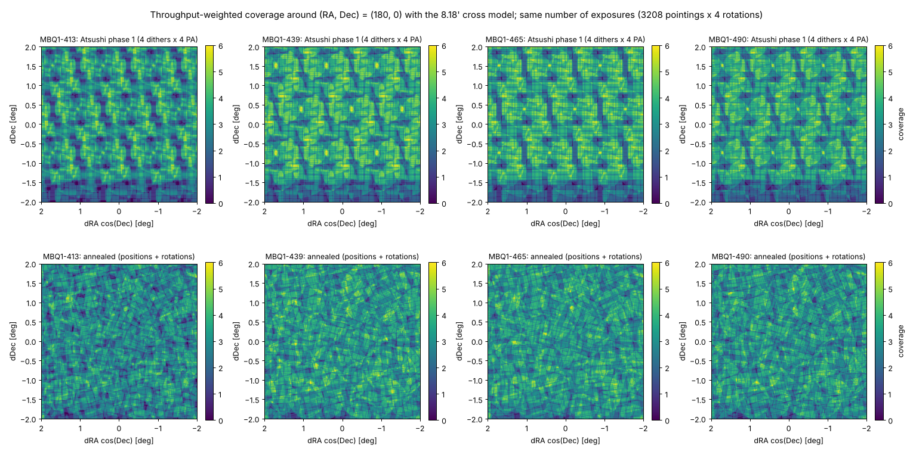
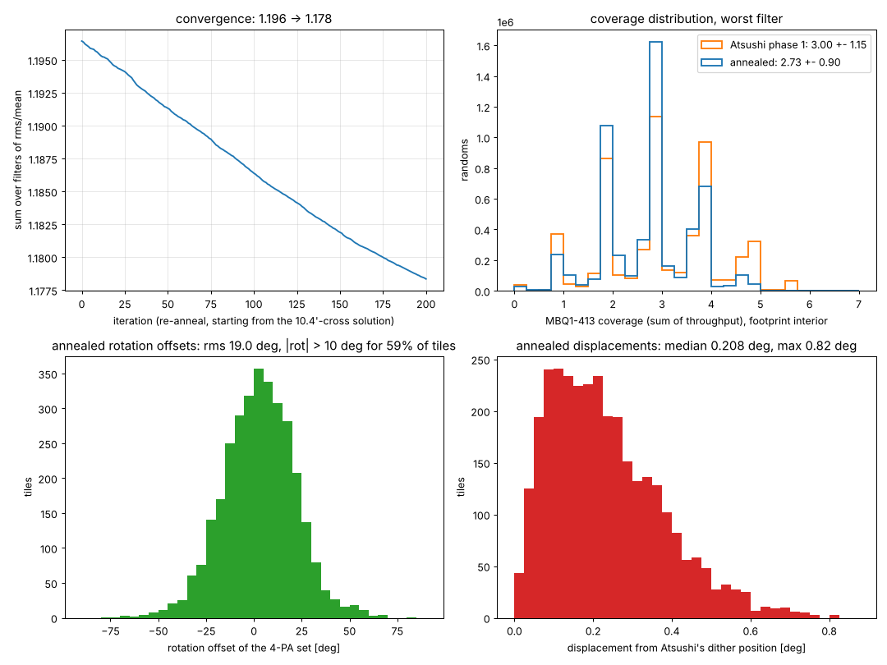
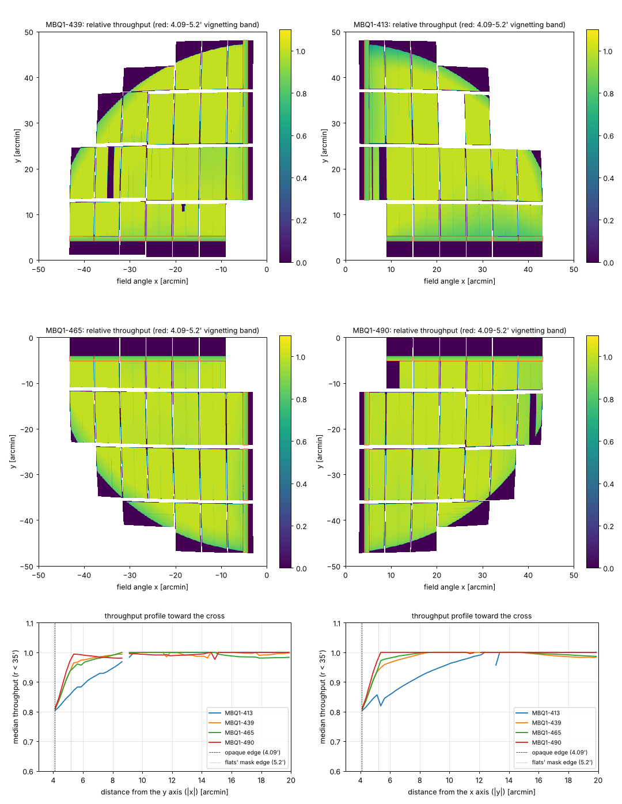

# Annealed tiling for HSC + MBQ1 with the 8.18′ cross model

*D. Schlegel, 2026-10-08. Code: `skytiling` (`optimize_tiling_maps`, `adjust_cross`); data in `data/subaru2/`.
Supersedes `hsc_mbq1_anneal_summary.md`, which used the 10.4′ cross implied by the flats.*

**Camera model.** Per-sub-filter maps of relative throughput on the focal plane, built from Hironao
Miyatake's MBQ1 dome flats (gain-corrected, sky-area-per-pixel and dome-illumination gradient divided
out, ≈1 over the bulk of the field, 0 where the flats' `NO_DATA` mask flags the vignetted edge beyond
46.5′, dead amplifiers, and the two CCDs absent from the 413 flats). The filter-holder cross is taken to
be opaque out to 4.09′ from each axis (8.18′ wide), narrower than the 5.2′ the flats mask; the band
between is treated as illuminated with a vignetting ramp that continues each quadrant's measured
trend from its value at 5.2′ down to 0.8 at the opaque edge (page 3). The four CCDs beside the central
column (`0_08, 0_16, 1_08, 1_16`) and the central column itself are not in the flats and are excluded.
Every pointing is observed at four instrument rotations 90° apart, and the coverage of a sky point in
sub-filter *f* is the sum of throughput over all exposures.

**Setup.** Simulated annealing moves each pointing centre and the rotation offset of its 4-PA set to
minimise the summed per-filter coverage variance over 4M random points inside the 1194 deg² footprint
(0.75° discs around the 802 HSC-SSP Wide centres at −6° < Dec < 6.4°). The exposure budget is that of
Atsushi's phase-1 pattern (4 dithers × 802 field centres × 4 PAs = 12,832 exposures; 3208 pointings).
The run started from the solution annealed against the 10.4′ model (itself started from Atsushi's
pattern) and ran 200 further iterations against the new maps on one Perlmutter node.

**Result** (footprint interior, 68% of the area; evaluated on 8M *independent* randoms; coverage =
effective number of full-throughput exposures):

| | 413 | 439 | 465 | 490 |
|---|---|---|---|---|
| Atsushi phase 1: mean ± rms (rms/mean) | 3.00 ± 1.15 (0.38) | 3.40 ± 1.09 (0.32) | 3.40 ± 1.11 (0.33) | 3.27 ± 1.04 (0.32) |
| &nbsp;&nbsp;&nbsp; fraction < 1.5 / < 0.5 | 9.1% / 0.75% | 4.0% / 0.32% | 4.2% / 0.54% | 4.1% / 0.25% |
| Solution annealed against the 10.4′ model | 2.74 ± 0.91 (0.33) | 3.13 ± 0.91 (0.29) | 3.10 ± 0.89 (0.29) | 3.00 ± 0.88 (0.29) |
| **Annealed against this model (adopted)** | **2.73 ± 0.90 (0.33)** | **3.12 ± 0.90 (0.29)** | **3.09 ± 0.88 (0.28)** | **2.99 ± 0.87 (0.29)** |
| &nbsp;&nbsp;&nbsp; fraction < 1.5 / < 0.5 | 7.8% / 0.62% | 3.5% / 0.19% | 3.4% / 0.17% | 4.2% / 0.23% |

With the narrower cross every tiling improves relative to the earlier model (Atsushi's pattern gains
most, since the band is exactly where its dithers leave gaps), but for the same number of exposures the
annealed tiling still has 21–23% lower rms in every filter (rms/mean lower by 9–14%), 15% fewer points
below 1.5 exposures and 10–70% fewer below 0.5, and none of the periodic structure of the lattice
(Figure 1). Its mean is 8–9% lower because pointings near the stripe boundary move outward to flatten
the edge and the coverage they put outside the footprint is not counted; in the interior it is more
uniform at every quantile. 413 remains the worst filter because of its two missing CCDs. Re-annealing
against the new maps gained only ~1.5% over simply re-using the previous solution: the mask change is
confined to a 1.1′ band, so the previous optimum was already close.

**Rotations and positions.** The adopted rotation offsets (Figure 2, lower left) have an rms of 19°,
with 59% of pointings turned by more than 10° and 10% by more than 30°, in a broad single-peaked
distribution (mean +3°). Pointings sit a median 0.21° from Atsushi's dither positions (max 0.82°); the
re-anneal moved them a median of only 0.015° and changed rotations by 2° rms from the 10.4′-model
solution. Rounding RA/Dec to 3 decimals and ROT to 0.1° changes the statistics by < 10⁻⁴.

**Convergence.** The objective fell from 1.196 to 1.178 over the 200 iterations (Figure 2, upper left);
the final slope of 7 × 10⁻⁵ per iteration means further iterations would gain well under 1%.

*Figure 1. Throughput-weighted coverage per sub-filter in a 4° × 4° field around (RA, Dec) = (180°, 0°),
with the 8.18′ cross model, for Atsushi's phase-1 pattern (top) and the adopted annealed tiling (bottom),
same colour scale.*

*Figure 2. Convergence of the re-anneal; distribution of MBQ1-413 coverage over the footprint interior;
adopted rotation offsets; and displacement of each pointing from Atsushi's dither position.*

*Figure 3. The throughput model for the four sub-filters (each quadrant at the maps' full 0.1′ resolution,
same scale; dark = masked, white = no detector; red outlines the 4.09–5.2′ band whose throughput ramps
to 0.8 at the opaque edge), and the median throughput toward the cross along x and y. The flats
themselves show the vignetting beginning well outside the band — strongly in 413 (0.86 at 5.2′, 0.82
next to the x axis), mildly in 439/465 (0.96), hardly at all in 490 — a quadrant asymmetry that may
reflect the filter-holder geometry and is worth checking.*

Files: `data/subaru2/anneal/nersc_atsushi2/hsc_mbq1_tiling_subaru2_final.{fits,csv}` (the adopted
table: `tileid, ra, dec, rot`; each row is one pointing to be observed at `rot`, `rot+90`, `rot+180`,
`rot+270`), with `tiles_0000.fits` / `tiles_0200.fits` (start and full-precision final) and
`convergence.txt`. The mapping of `rot` onto `INSROT_PA` (sign and zero point) still has to be
calibrated against the instrument.
