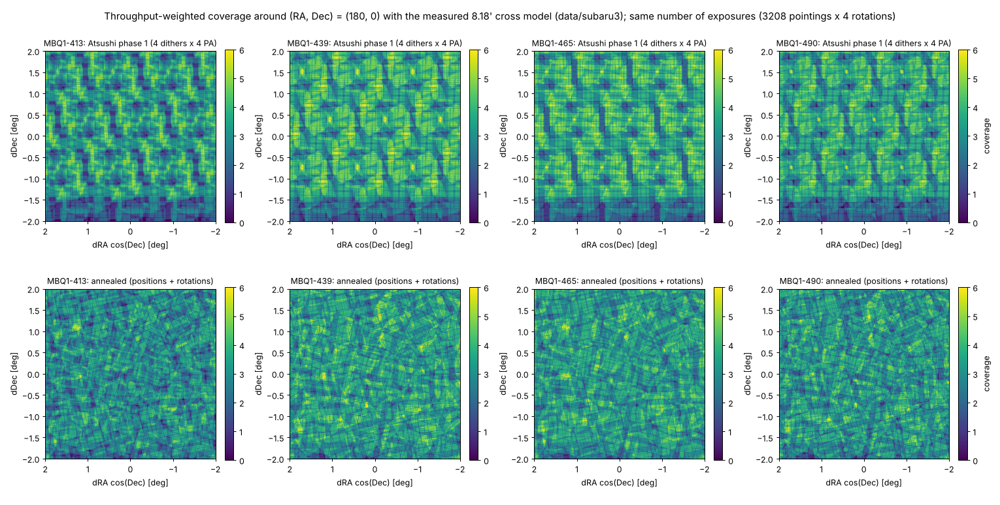
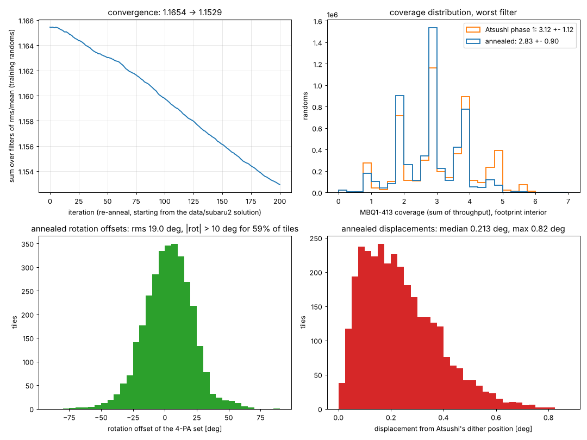
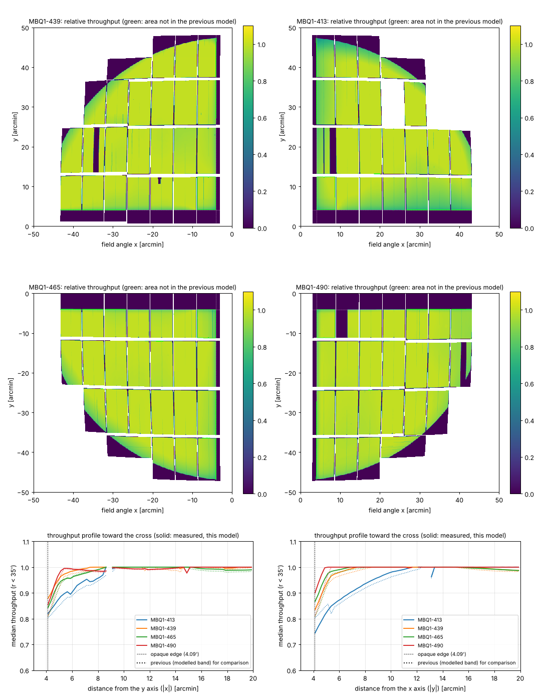

# Annealed tiling for HSC + MBQ1 with the measured 8.18′ cross model

*D. Schlegel, 2026-10-08. Code: `skytiling` (`optimize_tiling_maps`, `plot_throughput`); data in `data/subaru3/`.
Supersedes `hsc_mbq1_anneal_summary_subaru2.md` (modelled 8.18′ band) and `hsc_mbq1_anneal_summary.md`
(10.4′ cross). Written for the record: the tiling is of the original HSC-Niji wide footprint (802 HSC-SSP
Wide pointings), which is being replaced by the DESI Run 2 stripe footprint.*

**Camera model.** Per-sub-filter maps of relative throughput on the focal plane, now built by Hironao
Miyatake from dome flats *rebuilt with an 8.18′ cross mask and with the centre CCDs included*
(`hsc_mbq1_throughput_8p18.fits`, same `flats_to_throughput` recipe as before: gain-corrected, sky-area
Jacobian and dome-illumination trend divided out, ≈1 over the bulk of the field). Relative to the previous
model the vignetting band 4.09–5.2′ from each axis is measured rather than assumed, and the CCD of each
quadrant that touches the field centre (413: `1_08`, 439: `1_16`, 465: `0_08`, 490: `0_16`) is illuminated
inward to r ≈ 6′, adding 0.011–0.012 deg² (3.5–4%) of area per sub-filter (page 3). The flats of three
of those centre CCDs contain a light leak at r = 6–12′ that was fitted out, so their throughput at
r < 13.5′ is a smooth extrapolation rather than a measurement, and inside r < 12′ the radial trend is
extrapolated too (0.78–0.84 at r ≈ 6.5′). `1_34` and `1_47` are still absent from 413. Every pointing is
observed at four instrument rotations 90° apart; coverage of a sky point in sub-filter *f* is the sum of
throughput over all exposures.

**Setup.** As before: simulated annealing of each pointing centre and the rotation offset of its 4-PA set,
minimising the summed per-filter coverage variance over 4M random points in the 1194 deg² footprint
(0.75° discs around the 802 centres), with Atsushi's phase-1 exposure budget (3208 pointings × 4 PAs =
12,832 exposures). The run started from the solution annealed against the previous model and ran 200
iterations against the new maps on one Perlmutter node (`nersc/anneal_hsc_resume.sh`).

**Result** (footprint interior, 68% of the area; 8M *independent* randoms; coverage = effective number
of full-throughput exposures):

| | 413 | 439 | 465 | 490 |
|---|---|---|---|---|
| Atsushi phase 1: mean ± rms (rms/mean) | 3.12 ± 1.12 (0.36) | 3.54 ± 1.04 (0.29) | 3.51 ± 1.06 (0.30) | 3.39 ± 1.00 (0.30) |
| &nbsp;&nbsp;&nbsp; fraction < 1.5 / < 0.5 | 6.9% / 0.45% | 2.6% / 0.16% | 2.8% / 0.36% | 2.9% / 0.26% |
| Solution annealed against the previous model | 2.84 ± 0.91 (0.32) | 3.24 ± 0.93 (0.29) | 3.19 ± 0.89 (0.28) | 3.09 ± 0.90 (0.29) |
| **Annealed against this model (adopted)** | **2.83 ± 0.91 (0.32)** | **3.23 ± 0.92 (0.28)** | **3.18 ± 0.89 (0.28)** | **3.08 ± 0.89 (0.29)** |
| &nbsp;&nbsp;&nbsp; fraction < 1.5 / < 0.5 | 6.5% / 0.46% | 2.9% / 0.15% | 2.9% / 0.14% | 3.8% / 0.20% |

The recovered centre CCDs lift every tiling by about 4%, and they help Atsushi's regular pattern far more
than the annealed one: his four dithers are sized to fill the cross, and the new area sits exactly there,
so his holes below 1.5 exposures fall from 9.1 / 4.0 / 4.2 / 4.1% under the previous model to
6.9 / 2.6 / 2.8 / 2.9%. The annealed tiling keeps its advantage in uniformity — rms lower by 11–19% in
every filter, rms/mean lower by 3–11% — and in the worst filter has fewer holes, but in 439/465/490 it
now has slightly *more* area below 1.5 exposures than the regular pattern. Its interior mean is 9% lower
because the variance objective let boundary pointings drift outward (it puts 11% of its coverage beyond
the footprint, against 5.5% for Atsushi's pattern); that is the motivation for the rms/mean objective and
the rectangular footprint used from here on. Re-annealing against the new maps gained only 0.7% over
re-using the previous solution.

**Rotations and positions.** Rotation offsets (Figure 2, lower left): rms 19°, 59% of pointings turned by
more than 10° and 10% by more than 30°, mean +3°. Pointings sit a median 0.21° from Atsushi's dither
positions (max 0.82°); the re-anneal moved them a median 0.012° and changed rotations by 1.9° rms.
Rounding RA/Dec to 3 decimals and ROT to 0.1° changes the statistics by ≤ 10⁻⁴.

**Convergence.** The objective (sum over filters of rms/mean on the training randoms) fell from 1.1654
to 1.1529 over the 200 iterations (Figure 2, upper left).

*Figure 1. Throughput-weighted coverage per sub-filter in a 4° × 4° field around (RA, Dec) = (180°, 0°)
with this model, for Atsushi's phase-1 pattern (top) and the adopted annealed tiling (bottom), same
colour scale.*

*Figure 2. Convergence of the re-anneal; distribution of MBQ1-413 coverage over the footprint interior;
adopted rotation offsets; and displacement of each pointing from Atsushi's dither position.*

*Figure 3. The measured throughput model for the four sub-filters (each quadrant at the maps' full 0.1′
resolution, same scale; dark = masked, white = no detector; green outlines the area that was not in the
previous model — the centre CCD of each quadrant and the measured edge of the cross), and the median
throughput toward the cross along x and y (solid; dotted = the previous model's assumed ramp). The
measured penumbra is soft: in a raw flat the transmission across the arms is 0.98 / 0.95 / 0.90 / 0.75 /
0.50 at full widths of 10.7 / 10.2 / 9.0 / 7.2 / 4.9′ (vertical arm) and 16.3 / 12.3 / 9.7 / 6.3 / 3.5′
(horizontal), so 10.4′ is where the dimming is 2–5% and 8.18′ where it is 15–20%.*

Files: `data/subaru3/anneal/nersc_atsushi3/hsc_mbq1_tiling_subaru3_final.{fits,csv}` (`tileid, ra, dec,
rot`; each row one pointing observed at `rot`, `rot+90`, `rot+180`, `rot+270`), with `tiles_0000.fits` /
`tiles_0200.fits` (start and full-precision final) and `convergence.txt` (reconstructed from the
checkpoint headers). The mapping of `rot` onto `INSROT_PA` still has to be calibrated against the
instrument.
